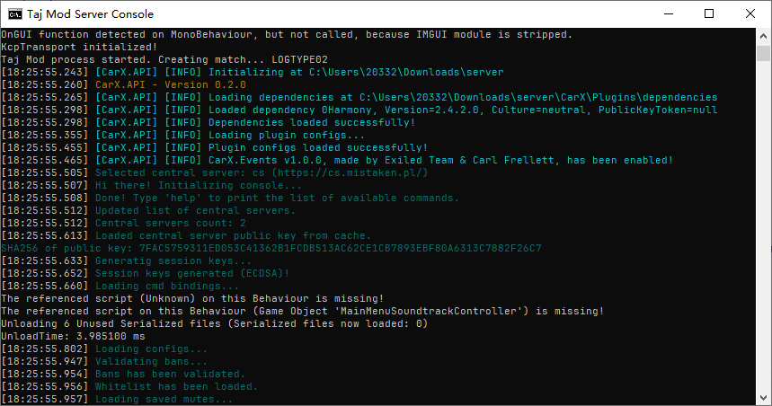
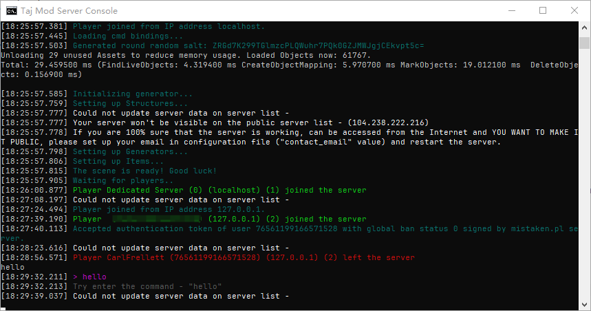

#  CarX API

> **A plugin framework for Taj Mod, adapted from Exiled.**

---

####  Features

- **Advanced Console:** An enhanced log display console for better debugging and monitoring.

- **Console Command System:** Allows you to register event listeners via code to capture commands entered by users on the server side.

- **Event System:** An Event System Implemented via HarmonyPatch.

####  Installation & Usage

Follow these steps to get started:

1. **Download:** Grab the latest release from the [Releases Page](https://github.com/Carl-Frellett/CarX/releases).
2. **Extract:** Unzip the downloaded file.
3. **Install:** Drag both the `CarX` folder and `Taj Mod_Data` folder into the **root directory** of your Taj Mod server.
4. **Run:** Start your server.

#### ️ Disclaimer

> **Note:** The CarX API is built upon code modified from **Exiled version 2.1.14**. It is not a plagiarism of Exiled, but rather a specialized plugin framework developed for Taj Mod based on Exiled's architecture.

####  Resources

- **Base Framework:** [Exiled 2.1.14](https://github.com/Exiled-Team/EXILED/tree/2.1.14).
